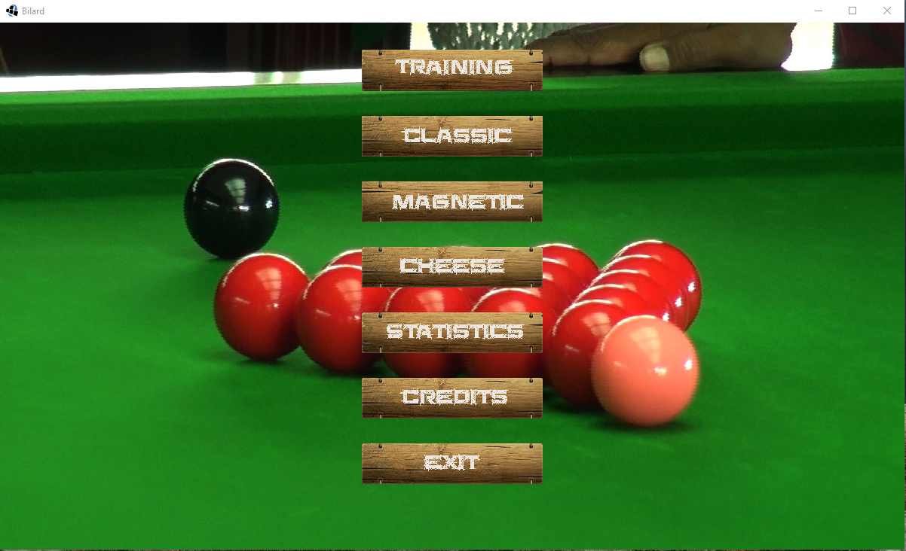
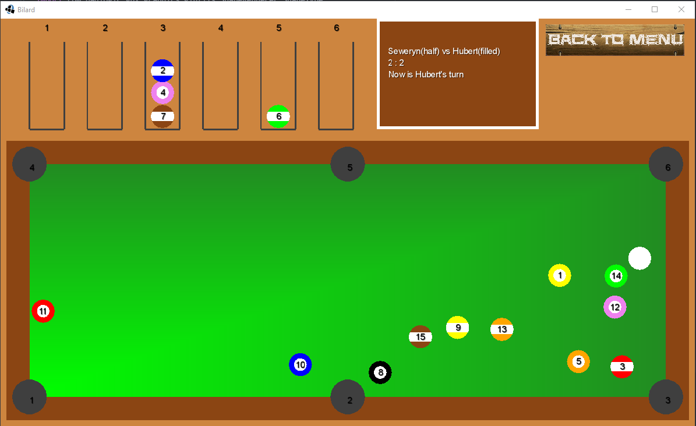
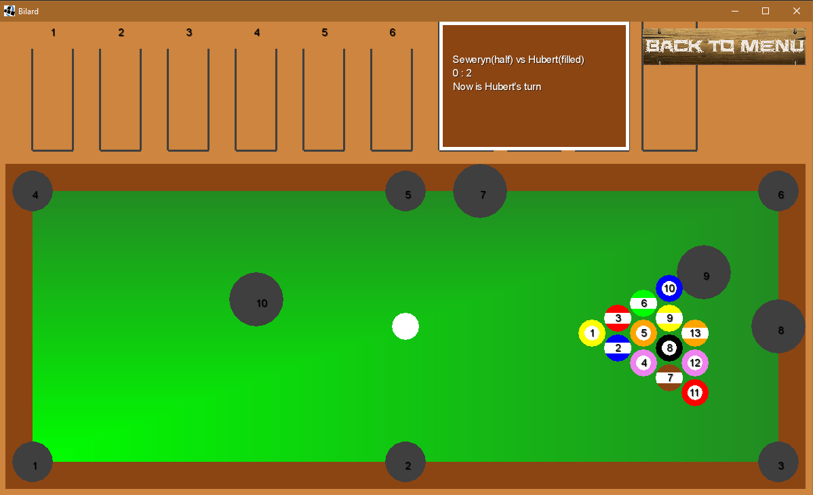
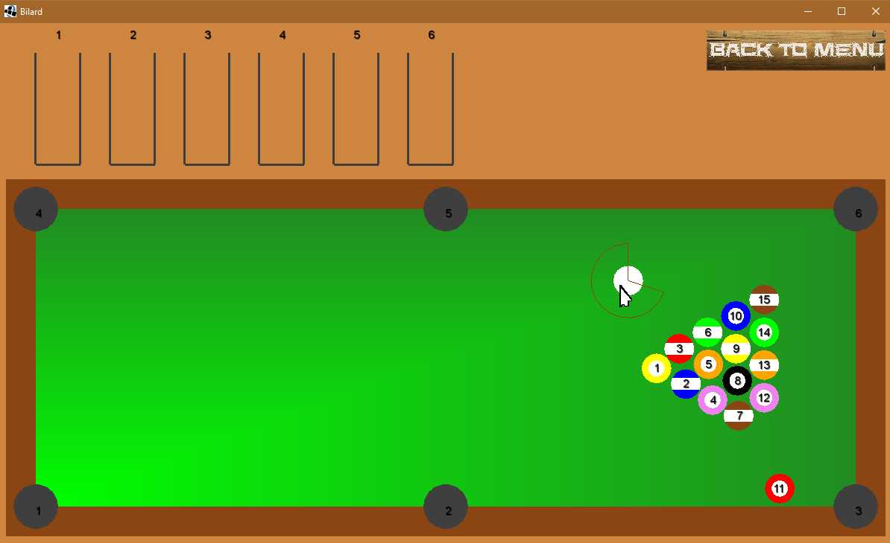
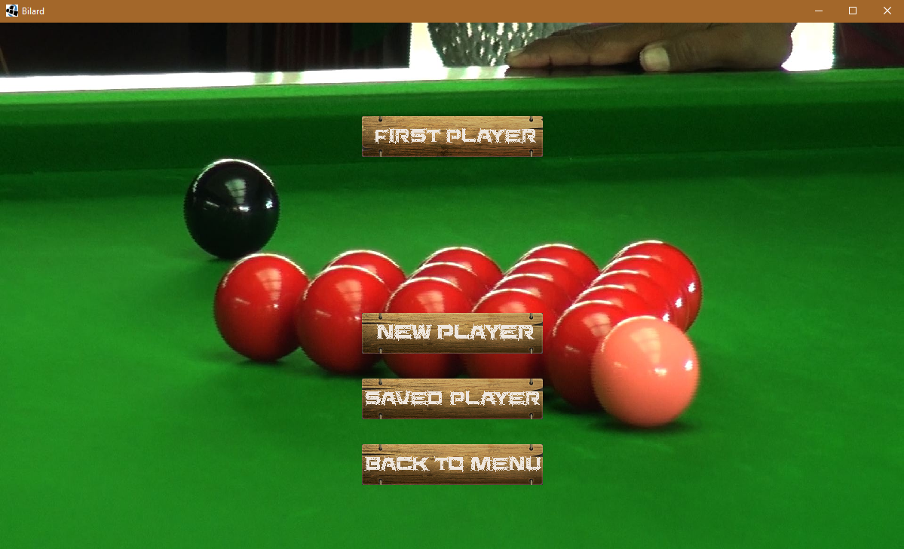

# billiards - libGDX

It is a Java game in the libGDX framework.

## Table of contents
* [billiards - libGDX](#billiards---libgdx)
	* [Technologies](#technologies)
	* [Setup](#setup)
	* [Usage](#usage)
	* [Structure of source code](#structure-of-source-code)

## Technologies

* Java
* libGDX framework: https://libgdx.com/

## Setup

The project was generated by [Project Setup Tool](https://libgdx.com/dev/project-generation/). Also libGDX projects are [Gradle](http://www.gradle.org/) projects, which makes managing dependencies and building considerably easier.

You can download project's files from this repository. Then run in terminal `./gradlew desktop:run` to compile and start the application.

If you want to use your IDE and configure Gradle, see this instructions: https://libgdx.com/dev/import-and-running/.

To build this project I have used Eclipse with Gradle configuration.

## Usage

When the game starts, the menu appears:

   

You can choose 4 types of game:
* training - only you play without an opponent,
* classic - game between two players,
* magnetic - game between two players, where the balls attract each other (as if they were magnetized),
* cheese - game between two players, where there are many different sized pockets in random places (like in swiss cheese).

Classic game:
 

Cheese game:
   

To hit a white ball with the stick, hold the cursor over it until the arc makes a complete circle. Then a stick will appear - the longer you hold it and it increases the distance from the white ball, the harder it will hit it.

   

In classic, magnetic and cheese game you select two users - from the menu you can add a new user nick or select one from saved ones.

   

## Structure of source code

`core/src/com/mygdx/bilard/` - directory with Java classes:
* Bilard.java
* Bill.java
* CheeseTable.java
* ClassicTable.java
* Hole.java
* MagneticTable.java
* StringListener.java
* Table.java
* ThreadCollisions.java
* ThreadMagneticCollisions.java
* User.java
* WhiteBill.java 

`core/assets/` - directory with images, sounds, music and text database.

For more information about libGDX framework' files structore, visit: https://libgdx.com/dev/project-generation/.
